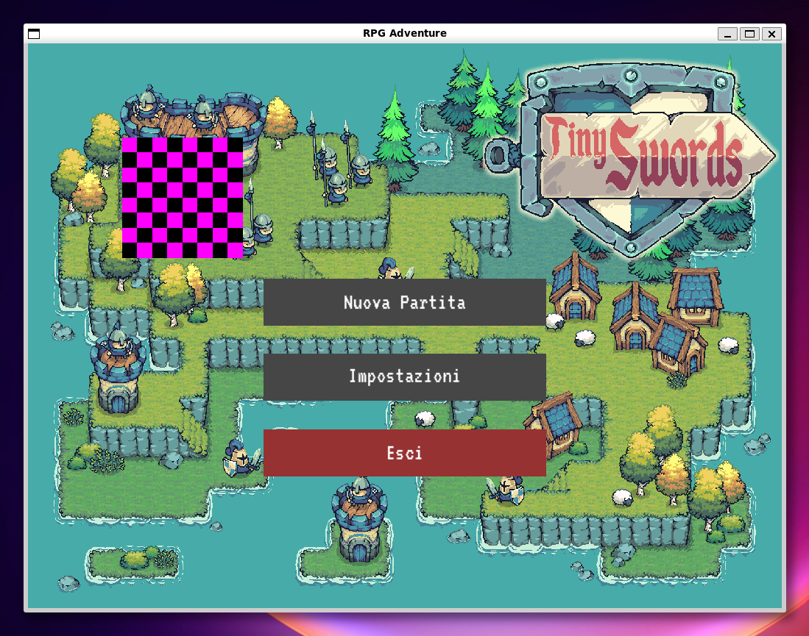

# RPG Adventure

This is a personal 2D RPG game project created for fun and to strengthen my understanding of C++ and the new C++23 standard features.

## Requirements

To build this project, you will need:

*   **C++ Compiler**: Must support C++23.
*   **CMake**: Version 3.22 or higher.
*   **SFML**: Simple and Fast Multimedia Library (Graphics, Window, System, Audio modules).
*   **EnTT**: Open-source, header-only Entity Component System (ECS) library.

## Documentation

You can find detailed documentation in the `doc/` directory:

*   [C++ Review](doc/cpp_review.md): A quick review of C++23 features.
*   [TODO](doc/todo_list.md): List of TODOs and future features.
*   [Naming Conventions](doc/naming_conventions.md): Naming Conventions used in this project.

---

*   [0. Project Overview](doc/core/0_structure_and_roadmap.md): Explains the project overview.
*   [1. Project Configuration & Setup](doc/core/1_project_setup.md): Explains the `.vscode` configuration and `CMakeLists.txt` file structure.
*   [2. Core Engine & State Machine](doc/core/2_0_core_engine_and_state_machine.md): Explains the core engine and state machine.
*   [2.1 Logging System, MainMenuState initialization](doc/core/2_1_logging_and_menu_state.md): Explains the logging system and the menu state initialization.
*   [3.0 Resource Management](doc/core/3_0_resource_managment.md): Explains the resource management system.
*   [3.5 MainMenuState & SettingsState](doc/core/3_5_main_menu_settings_core.md): Explains the main menu and settings.
*   [3.6 Audio System & Settings UI](doc/core/3_6_audio_system_and_settings_ui.md): Explains the audio system and settings UI.

---

### 🗺️ Roadmap Aggiornata

* ✅ **Fase 1: Setup dell'Ambiente e Boilerplate**
* ✅ **Fase 2: Core Engine & State Machine**
    * ✅ **2.1: Logging System, MainMenuState initialization**
* ✅ **Fase 3: Resource Management**
    * ✅ **3.5 - 3.6: UI, Audio e SettingsState**
* ✅ **Fase 4: Integrazione ECS (EnTT)**
    * ✅ **4.1: Registry Setup**
    * ✅ **4.2: Base Component**
    * ✅ **4.3: Render System**
    * ✅ **4.4: Game State & First Entoty**
* 🔄 **Fase 5: Input & Movimento**
* ⬜ **Fase 6: Tilemap & Collisioni**
* ⬜ **Fase 7: RPG Logic & UI**

---

